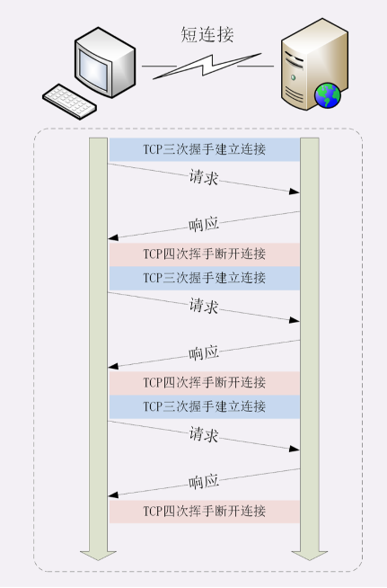

#### HTTP的连接管理

##### 一、短连接

    我们知道，HTTP是一个”请求-应答‘模型，底层是基于TCP/IP协议，在原先HTTP(0.9/1.0)协议中，**每一次的请求都需要和服务器建立一次连接，收到响应报文后，立即关闭连接，就这样每一请求需要建立一次连接，由于连接保持的时长很短，所以称之为短连接**

##### 二、长连接

    由于每一次的请求都需要建立一次连接，而且每一次连接的建立和断开，都需要经历三次握手和四次挥手的步骤，需要发送多个数据包。这样必然会消耗很多性能和时间。所以后续的HTTP/1.1中引入了长连接。

    **长连接就是，第一次请求时与服务器建立连接，然后长久保持这个连接，后续的多个请求都复用这个连接完成请求响应，由于连接保持的时间更久，所以叫长连接，也可以叫连接保活（keep alive）。**

    长连接其实是**成本分摊**的体现，将原有耗时的TCP连接和关闭分摊到过个请求-应答上。

      

##### 三、连接管理在HTTP中的体现

    长连接对于性能的提升很大，所以HTTP/1.1中默认开启长连接。**不需要指定用什么头字段协商，只需要向服务器发起了第一次的连接，后续的请求都会复用这个TCP连接**

    当然也可以在请求头里明确表示使用长连接，使用字段**Connection:keep-alive**表示

    同时不管客户端是否要求长连接，只要服务器支持长连接，都会在响应字段里返回**Connection:keep-alive**,告诉客户端自己支持长连接，下次请求复用这个连接

    当然，长连接也不是一直保持连接，长时间的连接，同样也是占用服务器资源的，所以也需要在合适的时间点关闭，当然最好是最后一次请求-响应结束后，所以客户端最好把握这个时间。因此，客户端会在请求头加上**Connection:close**通知服务器关闭连接，服务器得到通知后，调用Socket API关闭TCP连接。

       通常服务器不会主动关闭连接，但是，由于连接是耗费资源的，服务器也不可能完全任由客户端决定，所以像主流的服务器，都可以配置主动断开连接的时间，如nginx的配置文件里就可以配置**keep-alive:value**,表示超过多少时间，就主动断开，避免占用资源。

##### 四、长连接的问题--队头阻塞

##### 五、优化队头阻塞
