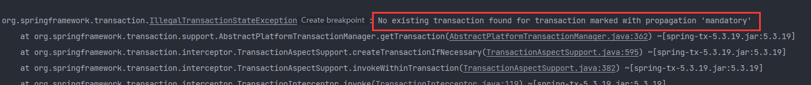
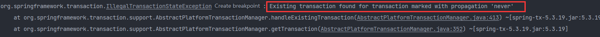

#### Spring事务传播机制

##### 一、何为Spring传播机制：

Spring事务的传播机制就是，事务如何在方法的调用如何传播。

##### 二、使用传播机制的时候的关键点：

- **使用声明式的事务时，调用方法和被调用方法不能在同一个类**。比如同在一个service方法中，这样是不会生效的。Spring的事务分为编程式和声明式的注解，我们一般使用声明方式的注解，利用@Transactional注解标记需要使用事务的类，Spring会利用AOP为我们在方法执行前启动事务，接受后提交和关闭事务。而AOP是基于动态代理的实现，生成代理对象，调用代理对象实现事务，而在同一个类中的调用，就会在这个类的对象调用this.method(),没有用到代理，也不会有事务。

- **使用Spring事务的方法需要被Spring所管理**。不然Spring无法通过AOP生成事务。

- **确保Spring开启事务支持。**

##### 三、理解事务传播机制的角度（个人见解）

刚开始，学习这个Spring事务传播机制的时候，一直纠结调用方法和被调用存在事务这一概念。其实如果从被调用的角度看存在和不存在事务，就能很好的理解这些传播机制。通过下面一些测试，我先猜想结果，在验证结果，也能证实自己是否理解了Spring事务的传播。

##### 四、Spring事务传播的七种方式

ps:测试其中方式的例子都是同一个，就是一个用户修改方法，修改用户名称；一个插入修改日志的方法，插入修改日志，在修改方法内调用插入日志的方法，目的是让两个数据库操作具有原子行，所以应用事务。同时利用除数为0创造异常，更好的测试。

###### 一、REQUIRE

```java
    @Override
    @Transactional(propagation = Propagation.REQUIRED,rollbackFor = Throwable.class)
    public void updateUserName(String userName) {
        User user = new User();
        user.setId(1);
        user.setUserName(userName);
        userMapper.updateUserName(user);
        userChangeLogService.saveLog(user.getId());
    }
```

```java
    @Override
    @Transactional(propagation = Propagation.REQUIRED,rollbackFor = Throwable.class)
    public void saveLog(Integer userId) {
        UserChangeLog userChangeLog = new UserChangeLog();
        userChangeLog.setOpratorUserId(userId);
        userChangeLogMapper.insert(userChangeLog);
        int i = 10 / 0;
    }
```

两个方法都是才有默认的事务传播属性Propagation.REQUIRED

Propagation.REQUIRED：如果当前存在事务，那么就加入这个事务，不存在就新建一个事务。

结果：这里也是两个方法都没有将操作成功，因为REQUIRE的事务传播机制下，调用者存在了一个事务，被调用者在已经存在事务的情况下，加入调用者这个事务，而不自己新创建，所以两者在同一事务种，被调用方法发生异常，整个事务回滚，都不操作成功。

###### SUPPORTS

Propagation.SUPPORTS:如果当前有事务，加入事务，如果没有则不使用事务

```java
    @Override
    @Transactional(propagation = Propagation.REQUIRED,rollbackFor = Throwable.class)
    public void updateUserName(String userName) {
        User user = new User();
        user.setId(1);
        user.setUserName(userName);
        userMapper.updateUserName(user);
        userChangeLogService.saveLog(user.getId());
    }
```

```java
    @Override
    @Transactional(propagation = Propagation.SUPPORTS,rollbackFor = Throwable.class)
    public void saveLog(Integer userId) {
        UserChangeLog userChangeLog = new UserChangeLog();
        userChangeLog.setOpratorUserId(userId);
        userChangeLogMapper.insert(userChangeLog);
        int i = 10 / 0;
    }
```

调用方法的传播属性是Propagation.REQUIRED，被调用的是Propagation.SUPPORTS

结果：这里也是两个方法都没有将数据操作成功--用户名称没有修改，修改日志也没有插入，发生了异常，两个数据操作都回滚了。因为调用方法存在事务，而被调用方法可以支持事务，有则加入到这个事务中，所以两方法处于同一事务，有异常则两者都回滚。

```java
   @Override
   // @Transactional(propagation = Propagation.REQUIRED,rollbackFor = Throwable.class)
    public void updateUserName(String userName) {
        User user = new User();
        user.setId(1);
        user.setUserName(userName);
        userMapper.updateUserName(user);
        userChangeLogService.saveLog(user.getId());
    }
```

```java
    @Override
    @Transactional(propagation = Propagation.SUPPORTS,rollbackFor = Throwable.class)
    public void saveLog(Integer userId) {
        UserChangeLog userChangeLog = new UserChangeLog();
        userChangeLog.setOpratorUserId(userId);
        userChangeLogMapper.insert(userChangeLog);
        int i = 10 / 0;
    }
```

调用方法的没有事务，被调用的是Propagation.SUPPORTS

结果：这里也是两个方法都将数据操作成功--用户名称修改，修改日志也插入即使有异常，因为SUPPORTS没有处在事务中，所以被调用方法也没使用事务执行,即使有异常也没有回滚

###### 三、NOT_SUPPORTED

NOT_SUPPORTED:表示不支持事务，如果用事务也不加入事务，没有事务以非事务运行

```java
  @Override
//    @Transactional(rollbackFor = ArithmeticException.class)
    public void updateUserName(String userName) {
        User user = new User();
        user.setId(1);
        user.setUserName(userName);
        userMapper.updateUserName(user);
        saveLog(user.getId());
    }

    @Override
    @Transactional(propagation = Propagation.NOT_SUPPORTED,rollbackFor = ArithmeticException.class)
    public void saveLog(Integer userId) {
        UserChangeLog userChangeLog = new UserChangeLog();
        userChangeLog.setOpratorUserId(userId);
        userChangeLogMapper.insert(userChangeLog);
        int i = 10 / 0;
    }
```

调用方法没有事务，被调用的是pagation = Propagation.NOT_SUPPORTED

结果：调用方法没有事务，被调用方法不支持事务，即使报错，数据库都操作成功。

```java
    @Override
    @Transactional(propagation = Propagation.REQUIRED,rollbackFor = Throwable.class)
    public void updateUserName(String userName) {
        User user = new User();
        user.setId(1);
        user.setUserName(userName);
        userMapper.updateUserName(user);
        userChangeLogService.saveLog(user.getId());
        //调用方发生异常
        int i = 10 / 0;
    }
```

```java
    @Override
    @Transactional(propagation = Propagation.NOT_SUPPORTED,rollbackFor = Throwable.class)
    public void saveLog(Integer userId) {
        UserChangeLog userChangeLog = new UserChangeLog();
        userChangeLog.setOpratorUserId(userId);
        userChangeLogMapper.insert(userChangeLog);
        int i = 10 / 0;
    }
```

调用方法的传播属性是Propagation.REQUIRED，被调用的是pagation = Propagation.NOT_SUPPORTED,且调用方法发生异常，被调用方法也发生异常。

结果：调用方法没有操作数据库成功，因为REQUIRED新建了一个新的事务，发生异常回滚。但是被调用方法操作数据库成功，因为NOT_SUPPOTS不支持事务，即使存在事务也不加入，所以即使有异常，也不回滚。

###### 四、REQUIRES_NEW

REQUIRES_NEW:不管是否存在事务，都以最新的事务执行，执行完在执行旧的事务

```java
    @Override
    @Transactional(propagation = Propagation.REQUIRED,rollbackFor = Throwable.class)
    public void updateUserName(String userName) {
        User user = new User();
        user.setId(1);
        user.setUserName(userName);
        userMapper.updateUserName(user);
        userChangeLogService.saveLog(user.getId());
        int i = 10 / 0;
    }
```

```java
    @Override
    @Transactional(propagation = Propagation.REQUIRES_NEW,rollbackFor = Throwable.class)
    public void saveLog(Integer userId) {
        UserChangeLog userChangeLog = new UserChangeLog();
        userChangeLog.setOpratorUserId(userId);
        userChangeLogMapper.insert(userChangeLog);
    }
}
```

调用方法的传播属性是Propagation.REQUIRED，被调用方法的是Propagation.REQUIRES_NEW

结果：调用方法操作数据库失败，因为自己所在得事务中有异常，且有事务，操作回滚。被调用操作数据库成功，因为创建了一个新的事务，与已经存在的事务无关，没有异常正常执行，调用方法和被调用方法处于两个不同得事务，因为.REQUIRES_NEW以新得事务执行。

###### 五、MANDATORY

MANDATORY：必须在一个事务中执行，如果没有事务，则抛出异常

```java
     @Override
    //@Transactional(propagation = Propagation.REQUIRED,rollbackFor = Throwable.class)
    public void updateUserName(String userName) {
        User user = new User();
        user.setId(1);
        user.setUserName(userName);
        userMapper.updateUserName(user);
        userChangeLogService.saveLog(user.getId());
    }
```

```java
    @Override
    @Transactional(propagation = Propagation.MANDATORY,rollbackFor = Throwable.class)
    public void saveLog(Integer userId) {
        UserChangeLog userChangeLog = new UserChangeLog();
        userChangeLog.setOpratorUserId(userId);
        userChangeLogMapper.insert(userChangeLog);
        //int i = 10 / 0;
    }
```

调用方法没有加入事务，被调用方法使用MANDATORY

结果：调用方法正常执行数据库操作，被调用方法抛出异常，且没有执行数据库操作（异常中断了程序），抛出的异常时因为被调用法必须在事务中执行，没有事务，抛出异常，异常如下：

- 

###### 六、NEVER

NEVER:以非事务的方式执行，如过存在事务异常

```java
    @Override
    @Transactional(propagation = Propagation.REQUIRED,rollbackFor = Throwable.class)
    public void updateUserName(String userName) {
        User user = new User();
        user.setId(1);
        user.setUserName(userName);
        userMapper.updateUserName(user);
        userChangeLogService.saveLog(user.getId());
    }
```

```java
    @Override
    @Transactional(propagation = Propagation.NEVER,rollbackFor = Throwable.class)
    public void saveLog(Integer userId) {
        UserChangeLog userChangeLog = new UserChangeLog();
        userChangeLog.setOpratorUserId(userId);
        userChangeLogMapper.insert(userChangeLog);
        //int i = 10 / 0;
    }
```

调用方法使用的QEQUIRE,会创建一个新的事务，被调用方法使用NEVER，两个方法都没有额外的异常。

结果：调用方法操作数据库不成功，被调用方法操作数据库不成功。因为被调用方法时NEVER的传播机制，调用方法有事务，被调用方法会抛出异常，导致本身执行不成功，抛出的异常也会导致调用方法的事务回滚，操作不成功。抛出的异常如下：

- 

###### 七、PROPAGATION_NESTED

PROPAGATION_NESTED：如果调用者不存在事务，那么被调用者自己创建事务，这种情况和REQUIRE一样。如果调用者存在事务，那么被调用者就在调用者的事务里嵌套一个事务，称为嵌套事务。

使用嵌套事务是用条件的：

- 数据库的支持

- JDK 1.4 才支持 java.sql.Savepoint 。所以JDK必须在1.4 及以上

- 还需要Spring中配置nestedTransactionAllowed=true。